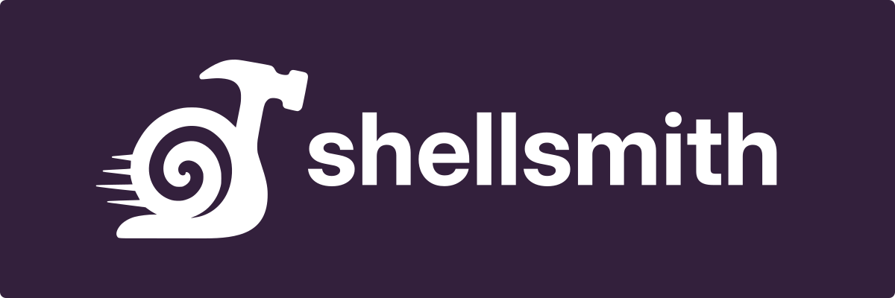

<style>
.md-content .md-typeset > h1:first-of-type {
  display: none;
}
</style>
<div style="margin: 2rem auto 1rem auto; text-align: center;">
  
</div>

<div style="margin-bottom: 1rem; text-align: center; font-style: italic;">
  A Python SDK and CLI for managing AAS resources.
</div>

**Shellsmith** is a Python SDK and CLI for managing [Asset Administration Shells (AAS)](https://industrialdigitaltwin.org/en/content-hub/aasspecifications), Submodels, and Submodel Elements via the [Eclipse BaSyx](https://www.eclipse.org/basyx/) REST API.

It provides full client-side access to AAS resources through a clean Python interface and a powerful command-line tool — ideal for scripting, automation, and digital twin integration workflows.

<!-- termynal -->

```
$ pip install shellsmith
---> 100%
Installed
```

---

## Features

- 🐍 Python SDK for full CRUD access to AAS resources
- ⚡ CLI powered by [Typer](https://typer.tiangolo.com/)
- ⚙️ `.env`-based configuration
- 🔁 Seamless integration with Eclipse BaSyx

---

📂 Use the top navigation to explore the CLI, Python API, and development setup.
